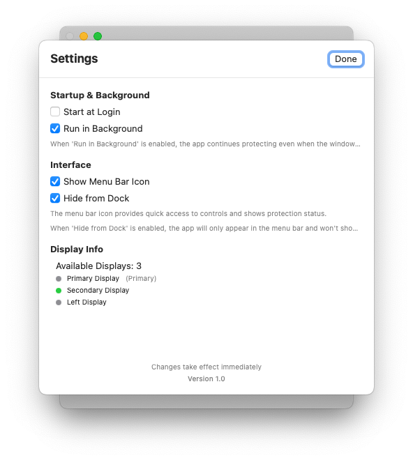

# DockAnchor

A macOS app that prevents the dock from moving between displays in multi-monitor setups.


## Problem

In macOS with multiple monitors, the dock automatically moves to whichever display your cursor approaches at the bottom edge. This can be distracting and interfere with workflow, especially when you want the dock to stay on your primary display.

## Solution

DockAnchor intercepts mouse movement events and blocks the dock from moving to secondary displays. Unlike scripts that kill and restart the dock (causing flashing and animations), DockAnchor prevents the movement entirely at the system level.

## Features



- **Seamless Protection**: Blocks dock movement without visual interruptions
- **System-Level Integration**: Uses macOS accessibility APIs for clean interception
- **Background Operation**: Runs silently in the background with optional menu bar icon
- **Smart Detection**: Automatically detects dock position (bottom, left, right)
- **Multi-Display Aware**: Works with any number of connected displays
- **User-Friendly Interface**: Simple controls and status monitoring
- **Dock Visibility Control**: Option to hide app from dock when running
- **Smart Window Management**: Prevents multiple app instances when clicking dock icon
- **Display-Specific Anchoring**: Choose which display to anchor the dock to

## Installation

### Building from Source
1. Clone this repository
2. Open `DockAnchor.xcodeproj` in Xcode
3. Build and run the project
4. **Grant accessibility permissions when prompted** (required for functionality)
5. Optionally enable "Start at Login" in settings

### Download Pre-Built App
- Download the latest release from the releases page

## Required Permissions

### Accessibility Permissions (Required)
DockAnchor requires accessibility permissions to function properly. This allows the app to:
- Monitor mouse movement events across all displays
- Intercept dock trigger events on secondary displays
- Provide seamless dock movement prevention

**To grant permissions:**
1. When first launched, DockAnchor will prompt for accessibility access
2. Go to **System Preferences → Security & Privacy → Privacy → Accessibility**
3. Click the lock icon to make changes
4. Add DockAnchor to the list and check the box
5. Restart DockAnchor if needed

**Note:** Without accessibility permissions, DockAnchor cannot prevent dock movement between displays.

## Usage

### First Launch
1. Launch DockAnchor
2. Click "Start Protection" to begin monitoring
3. **Grant accessibility permissions when prompted** (see above)
4. The dock will now be anchored to your selected display

### Menu Bar Icon
- Shows protection status (green = active, red = inactive)
- Right-click for quick access to controls
- Left-click to open the main window
- Displays current anchor display and protection status

### Settings

#### Startup & Background
- **Start at Login**: Automatically launch DockAnchor when you log in
- **Run in Background**: Keep protection active even when window is closed

#### Interface
- **Show Menu Bar Icon**: Display status icon in menu bar
- **Hide from Dock**: Hide the app from the dock when running (access via menu bar only)

#### Display Selection
- **Anchor Display**: Choose which display the dock should stay on
- **Display Detection**: Automatically detects all connected displays with friendly names
- **Primary Display Support**: Special handling for primary display designation

## How It Works

DockAnchor works by:

1. **Event Monitoring**: Creates a low-level event tap to monitor mouse movements
2. **Zone Detection**: Calculates dock trigger zones on secondary displays
3. **Event Blocking**: Prevents mouse events from reaching the dock when in trigger zones
4. **Status Tracking**: Provides real-time feedback on protection status
5. **Display Management**: Uses system APIs to get actual display names and positions

This approach is superior to dock-killing scripts because:
- No visual flashing or animations
- No interruption to running applications
- No dock restart delays
- Seamless user experience

## Technical Details

### System Requirements
- macOS 10.15 (Catalina) or later
- **Accessibility permissions (required)**
- Multiple displays (for the feature to be useful)

### Permissions Required
- **Accessibility**: Required to monitor mouse events and control system behavior
- **Apple Events**: Used to force dock positioning when needed

### Architecture
- **SwiftUI**: Modern declarative UI framework
- **Core Data**: Settings and preferences storage
- **Accessibility APIs**: System-level event monitoring
- **Menu Bar Integration**: Background operation support
- **Display Detection**: System profiler integration for display names

## Privacy & Security

DockAnchor:
- Only monitors mouse movement events
- Does not collect or transmit any personal data
- Runs entirely locally on your machine
- Source code is open and auditable
- **Requires accessibility permissions for core functionality**

## Troubleshooting

### Accessibility Permission Issues
1. Open **System Preferences → Security & Privacy → Privacy → Accessibility**
2. Ensure DockAnchor is listed and checked
3. If not listed, click the lock, then drag DockAnchor from Applications to the list
4. **Restart DockAnchor** after granting permissions
5. If issues persist, try removing and re-adding DockAnchor to the accessibility list

### Protection Not Working
1. **Verify accessibility permissions are granted** (most common issue)
2. Check that protection is enabled (green status indicator)
3. Try restarting the app
4. Use "Force Dock to Primary Display" button to reset dock position
5. Check that the selected anchor display is correct

### App Won't Start at Login
1. Check Settings → "Start at Login" is enabled
2. Verify the app has proper permissions
3. Try manually adding to Login Items in System Preferences → Users & Groups

### Dock Click Issues
- **Problem**: Clicking dock icon opens multiple app instances
- **Solution**: Fixed in latest version - dock clicks now bring existing window to front
- **Alternative**: Use "Hide from Dock" setting to prevent dock icon entirely

## Development

### Building from Source
```bash
git clone https://github.com/yourusername/DockAnchor.git
cd DockAnchor
open DockAnchor.xcodeproj
```

### Contributing
1. Fork the repository
2. Create a feature branch
3. Make your changes
4. Test thoroughly on multiple monitor setups
5. **Ensure accessibility permissions work correctly**
6. Submit a pull request

## License

MIT License - see LICENSE file for details.

## Support

For issues, feature requests, or questions:
- Open an issue on GitHub
- Provide system information (macOS version, monitor setup)
- **Include accessibility permission status**
- Include steps to reproduce any problems
- Check the troubleshooting section above first
